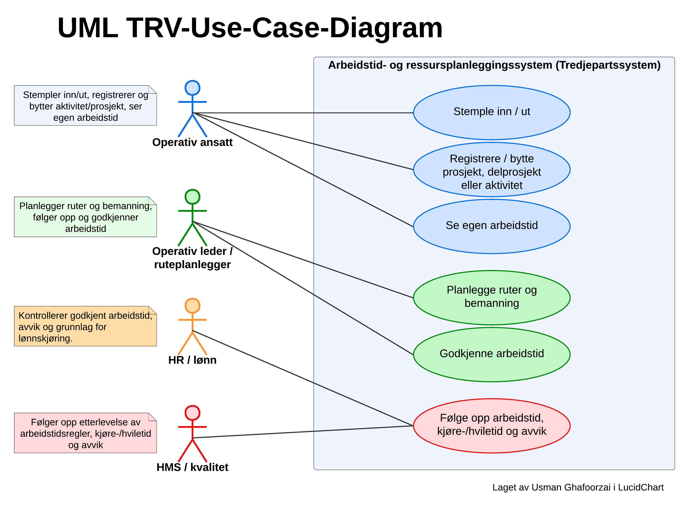
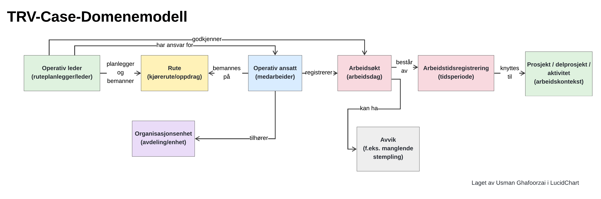
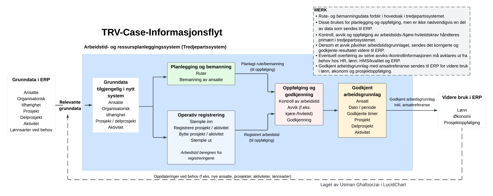
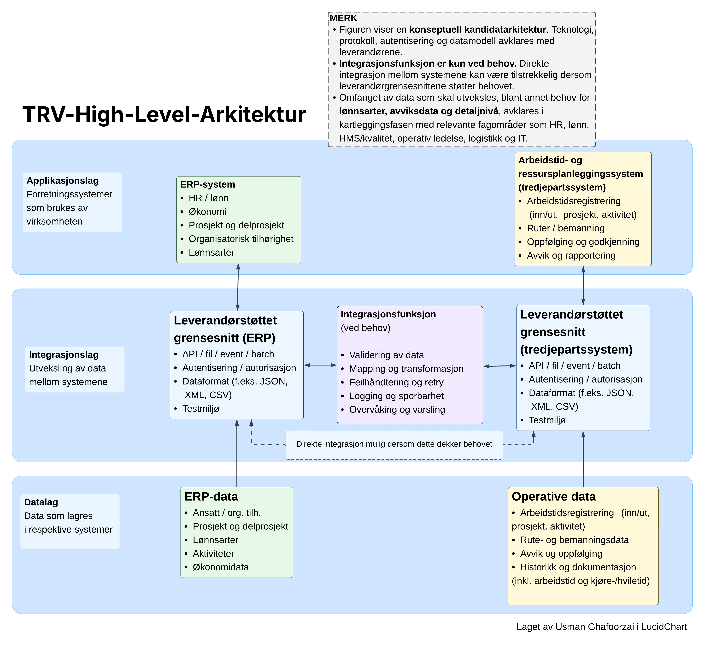
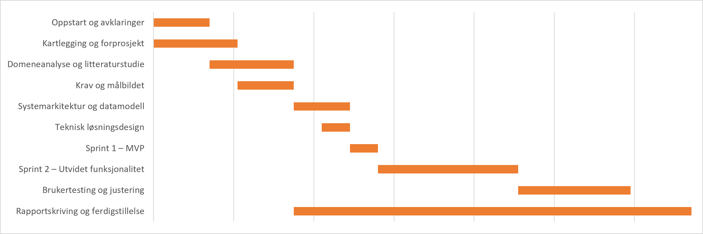

# TRV – innføring av arbeidstids- og ressursplanleggingssystem

Casebesvarelse utarbeidet av **Usman Ghafoorzai**.

Oppgaven gjelder innføring av et nytt tredjepartssystem for arbeidstid og ressursplanlegging, som skal fungere sammen med virksomhetens eksisterende ERP-system.

Jeg har behandlet caset som et lite forprosjekt. Før jeg velger API eller tegner en ferdig arkitektur, må jeg forstå arbeidsprosessen, brukerne, dataene og systemansvaret. Deretter kan jeg finne ut hva som faktisk må integreres og hvordan.

## Tilnærming

**Forstå behovet → Hvem gjør hva? → Hvilke begreper og data berøres? → Hvem eier hva og hvor skal det flyte? → Hvordan kan flyten realiseres? → Holder antakelsene teknisk? → Hvordan innfører vi løsningen? → Ble situasjonen faktisk bedre?**

Jeg viser en rekkefølge her, men kartlegging, Use Case, krav og domenemodell ville utviklet seg i takt med nye avklaringer.

## Sentrale avklaringer

Arbeidet avdekket spørsmål som må avklares før løsningen låses:

- **ERP støtter allerede timeføring.** Hvorfor trengs et separat system når ERP kan registrere og kategorisere timer mot prosjekt, delprosjekt og aktivitet? Arbeidshypotesen min er at tredjepartssystemet kan dekke den operative arbeidsprosessen bedre: stempling inn/ut, løpende registrering og aktivitetsskifte, rute/bemanning, oppfølging og godkjenning. Dette må valideres for å unngå overlappende prosesser, dobbeltregistrering og to ulike sannheter.

- **Toveis dataflyt betyr ikke toveis eierskap til alle data.** ERP er foreløpig kandidat som autoritativ kilde for ansatte, organisatorisk tilhørighet, prosjekt og delprosjekt. Tredjepartssystemet er kandidat som kilde for operative arbeidstidsregistreringer, rute/bemanning, oppfølging og godkjenning. Retur til ERP gjelder relevant godkjent arbeidsgrunnlag, ikke vedlikehold av ERP-masterdata.

- **Aktivitet omtales som en «ekstra dimensjon».** Jeg vil derfor ikke automatisk plassere aktivitet under delprosjekt. Hva betyr den i ERP, hvordan brukes den, og er den en separat klassifiseringsdimensjon? Dette må avklares før vi bestemmer om og hvordan den skal mappes.

- **Rute/bemanning er ikke automatisk prosjektføring.** De kan være parallelle behov. En rute bestemmer ikke nødvendigvis prosjekt, delprosjekt eller aktivitet; en eventuell kobling må avklares.

- **Godkjenning og roller må avklares.** Operativ leder er en naturlig kandidat for operativ godkjenning. HR/lønn kan ha kontroll-, oppfølgings- og avviksansvar, men virksomheten må avklare den endelige arbeidsdelingen.

- **Arbeidstid kan beregnes fra hendelser.** Innstempling, arbeidsperioder, prosjekt-/aktivitetsskifte og utstempling kan gi arbeidstiden uten en separat manuell registrering av «faktisk arbeidstid».

- **Lønnsarter ved behov.** ERP har lønnsarter, men det må avklares om de skal overføres og brukes til klassifisering i tredjepartssystemet, eller om ERP/lønn skal utlede dem fra godkjent arbeidsgrunnlag.

- **Ikke alle data trenger å flyttes.** Rute-, bemannings- og detaljert avviksinformasjon kan bli værende i tredjepartssystemet. Hvis et avvik påvirker arbeidstiden, kan det korrigerte og godkjente resultatet være det ERP trenger, fremfor hele historikken.

- **Integrasjonen må gå gjennom støttede grensesnitt.** Den skal ikke skrive direkte til systemenes databaser. Hvert system eier og oppdaterer sitt eget datalag.

- **Teknologivalget er åpent.** API, fil, batch, event/webhook og eventuell integrasjonsfunksjon må vurderes mot leverandørstøtte, oppdateringsbehov, datamengde, mapping og feil- og driftsbehov.

---

## 1. Kartlegging og organisering

Før jeg kan bestemme hva det nye systemet skal overta, må jeg forstå dagens arbeidsprosess og hvem som berøres. Jeg ville kartlagt timeføringen, manuelle steg, problemer og hva som må fungere ved første produksjonssetting.

Det krever innspill fra operative ansatte, operativ ledelse, HR/lønn, økonomi, HMS/kvalitet, logistikk/ruteplanlegging, IT og leverandørene. Forprosjektet skal redusere usikkerheten før vi begynner å bygge.

### Use Case

Når aktørene er identifisert, bruker jeg Use Case for å avklare **hvem som faktisk skal gjøre hva i den nye arbeidsprosessen**.

Operativ ansatt registrerer, operativ leder/ruteplanlegger planlegger og følger opp, mens HR/lønn og HMS/kvalitet har kontroll- og oppfølgingsbehov. Rollebildet er foreløpig, særlig ansvaret for godkjenning.

[Forprosjektplan](docs/01-forprosjekt/forprosjektplan.pdf)\
[Kravdokumentasjon](docs/02-krav-og-analyse/kravdokumentasjon.pdf)

Use Case gir et bilde av hvem som gjør hva og et grunnlag for kravene. Neste spørsmål er hvilke forretningsbegreper og data handlingene berører. Derfor går jeg videre til domenemodellen.

---

## 2. Data og integrasjoner

Handlingene i Use Case må knyttes til et felles språk før API-er, databaser og tekniske modeller bestemmes.

### Domenemodell

Hovedkjeden jeg har brukt er:

**Operativ ansatt → Arbeidsøkt → Arbeidstidsregistrering → relevant prosjekt/delprosjekt/aktivitet**

Modellen er konseptuell og viser forretningsbegreper og relasjoner, ikke database- eller API-design. En ansatt tilhører en organisasjonsenhet og kan bemannes på en rute. En arbeidsøkt kan ha avvik som må følges opp. Aktivitet som ekstra dimensjon og en eventuell kobling mellom rute og prosjekt må avklares før modellen detaljeres.

Når begrepene og relasjonene er tydeligere, kan jeg spørre hvor dataene finnes, hvem som bør eie dem og hvor de må videre.

### Informasjonsflyt

Informasjonsflyten knytter begrepene til systemene. Med dataeierskapet som arbeidshypotese blir flyten:

**ERP → tredjepartssystem:** relevante grunndata\
**Tredjepartssystem:** operativ registrering, rute/bemanning, oppfølging og godkjenning\
**Tredjepartssystem → ERP:** relevant godkjent arbeidsgrunnlag

Aktivitet må avklares, og lønnsarter overføres ved behov. Arbeidsgrunnlaget tilbake kan omfatte ansattreferanse, dato/periode, godkjente timer og relevant prosjekt-, delprosjekt- og aktivitetsinformasjon. Øvrige operative data deles bare dersom ERP trenger dem.

**Målet er ikke å holde to komplette systemkopier synkronisert, men å etablere tydelig dataeierskap og flytte den informasjonen mottakssystemet faktisk trenger.**

Når dataeierskap, retning og informasjonsbehov er tydeligere, kan denne flyten oversettes til en teknisk kandidatarkitektur.

---

## 3. Teknisk tilnærming

Informasjonsflyten gir grunnlaget for å spørre hvordan systemene kan kobles sammen. Jeg ville valgt den enkleste løsningen som dekker behovet og som leverandørene faktisk støtter.

### High-Level kandidatarkitektur

Figuren viser en **konseptuell kandidatarkitektur**, ikke en ferdig løsning:

- **Applikasjonslaget:** systemene og prosessene de har ansvar for.
- **Integrasjonslaget:** datautveksling gjennom leverandørstøttede grensesnitt.
- **Datalaget:** logisk dataeierskap; hvert system oppdaterer sitt eget interne datalag.

Pilene forutsetter ingen direkte databaseintegrasjon. De må forstås slik:

**Integrasjon → støttet grensesnitt → applikasjon → systemets eget datalag**

Mulige mekanismer må vurderes mot behovet:

| Mekanisme | Hva den innebærer |
|---|---|
| API | Direkte programmatisk kommunikasjon mellom systemene. REST er ikke forhåndsvalgt. |
| Fil | Utveksling via eksempelvis CSV, XML eller JSON dersom leverandøren og behovet tilsier det. |
| Batch | Data behandles samlet med et intervall, via API eller fil. |
| Event/webhook | Systemet varsler når en relevant hendelse skjer. |

### Aktuelle kandidater i TRVs teknologimiljø

Valget bør passe med det TRV kan drifte og forvalte. Stillingsannonsen nevner Microsoft 365, SharePoint, Power Platform, Logic Apps, Power Automate og API-baserte integrasjoner. Jeg ville derfor vurdert eksisterende teknologi før en ny plattform:

- **Logic Apps:** kandidat for «integrasjonsfunksjon ved behov», med mapping, validering, orkestrering, retry, logging, overvåking eller flere flyter.
- **Power Automate:** kandidat for brukerorienterte arbeidsflyter, varsling og eventuell godkjenning.
- **Power Apps / Microsoft 365:** mulige interne støtteflater rundt kjernesystemene dersom behovet oppstår.

Dette er kandidater, ikke forhåndsvalgte løsninger. Leverandørstøtte og faktisk behov styrer valget; et mellomlag innføres ikke bare fordi teknologien finnes.

Direkte leverandørintegrasjon er første kandidat dersom den er sikker og forvaltbar. En egen integrasjonsfunksjon må gi tydelig verdi gjennom eksempelvis mapping, validering, retry, logging/sporbarhet, overvåking, flere flyter eller løsere kobling.

Arkitekturen bygger fortsatt på antakelser om leverandørgrensesnitt, dataformat og feilmekanismer. Derfor ville jeg ikke låst den før representative flyter er verifisert.

### Tekniske avklaringer og PoC

Dokumentasjon og diagrammer viser ikke alene at integrasjonen fungerer. I leverandørenes testmiljø ville jeg prøvd:

- **ERP → tredjepartssystem:** én testansatt og ett prosjekt eller én aktivitet.
- **Tredjepartssystem → ERP:** ett godkjent arbeidsgrunnlag.

Flytene kan verifisere autentisering, mapping, dataformat, feilrespons, duplikater, retry ved behov og sporbarhet før resten av løsningen bygges.

[Teknologier og tekniske avklaringer](docs/04-teknisk-tilnaerming/teknologier-og-tekniske-avklaringer.pdf)

Når den tekniske gjennomførbarheten er demonstrert, kan prosjektet gå kontrollert videre til implementasjon, testing og pilot.

---

## 4. Gjennomføring og innføring

PoC-en reduserer teknisk usikkerhet. Nå må løsningen også prøves i arbeidsprosessen den skal støtte:

**Kartlegging → Teknisk PoC → Konfigurasjon/integrasjon → Testing → Pilot/opplæring → Produksjonssetting → Oppfølging/forvaltning**

Jeg ville ikke gått direkte fra teknisk test til full utrulling. En representativ pilot må verifisere arbeidsprosessen, integrasjonen, ERP-grunnlaget og brukeropplevelsen. Opplæringen må tilpasses rollene.

Etter produksjonssetting trengs stabilisering, overvåking, avstemming og brukeroppfølging, før løsningen overtas av forvaltningen.

### Overordnet tidsplan

Gantt er en overordnet illustrasjon av fremdrift. Varighet, avhengigheter og bemanning må avklares etter kartlegging og leverandørdialog; detaljplanen er ikke låst.

[Roadmap – gjennomføring og innføring](docs/05-gjennomforing/roadmap.pdf)

Selv om løsningen er satt i produksjon, gjenstår det viktigste spørsmålet: Ble situasjonen faktisk bedre?

---

## 5. Risiko og måloppnåelse

**Prosjektet har ikke nødvendigvis lykkes bare fordi løsningen er satt i produksjon.**

Jeg ville særlig fulgt opp uklart system- og dataeierskap, feil ERP-grunnlag, leverandørbegrensninger, integrasjonsfeil og manglende sporbarhet. Lav brukeradopsjon og uklar overgang til forvaltning kan også hindre at løsningen gir verdi.

Der det er mulig ville jeg etablert en baseline før innføring og vurdert om vi får færre manuelle korrigeringer, mindre dobbeltregistrering, bedre arbeidstidsdata og korrekt ERP-grunnlag. Brukeradopsjon, stabil drift og tydelig forvaltningsansvar må også følges opp. Målene må bygge på utgangspunktet, ikke tilfeldige prosentsatser.

[Risiko og måloppnåelse](docs/06-risiko-og-maal/risiko-og-maaloppnaaelse.pdf)

---

## Avslutning

Jeg oppsummerer arbeidet i tre prinsipper:

1. **Forstå prosessen før teknologien.**
2. **Avklar system- og dataeierskap før integrasjonen bygges.**
3. **Verifiser teknisk og organisatorisk før full utrulling, og mål effekten etterpå.**

Diagrammene er beslutningsgrunnlag som bygger på hverandre gjennom disse avklaringene.

## Dokumentasjon

Underlagsdokumentene gir detaljene:

- [Forprosjektplan](docs/01-forprosjekt/forprosjektplan.pdf)
- [Kravdokumentasjon](docs/02-krav-og-analyse/kravdokumentasjon.pdf)
- [Teknologier og tekniske avklaringer](docs/04-teknisk-tilnaerming/teknologier-og-tekniske-avklaringer.pdf)
- [Roadmap](docs/05-gjennomforing/roadmap.pdf)
- [Risiko og måloppnåelse](docs/06-risiko-og-maal/risiko-og-maaloppnaaelse.pdf)

DOCX-versjonene ligger i de samme mappene som redigerbare kildefiler.
